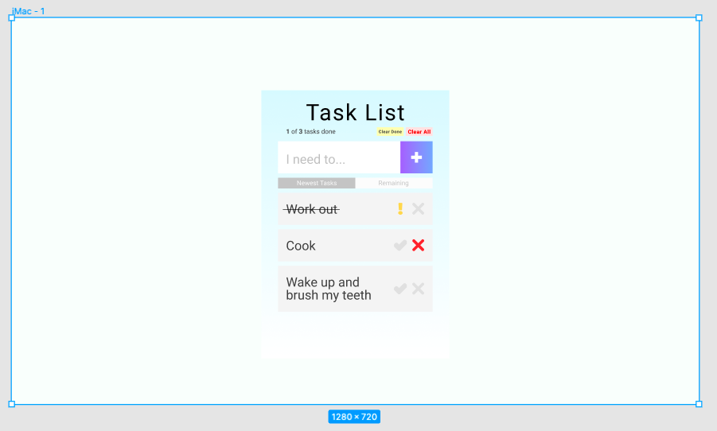

# TaskThat Mockup

-------------------------------------------

## Description

Going for simple and pleasant. Desktop mockup, mobile will just have the lists with no surrounding white space. Love the colour blue. Made in Figma.

## Iterations

1. Added bar to count completed tasks so far and two buttons for removing completed and removing all entries
2. Made crossed off entry the indicator for task completion, as opposed to having a green check mark
3. Added "exclamation mark" when item is completed, as a toggle option to undue a completed task
4. Added two buttons right below input field, will sort tasks. By default, ordered by my recent entries on top
5. Demonstrated how a longer entry will increase the side of the tasks bars
